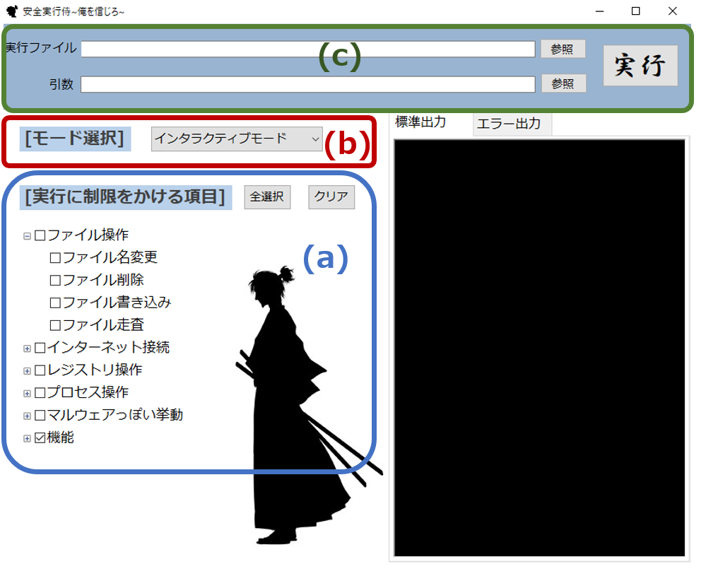
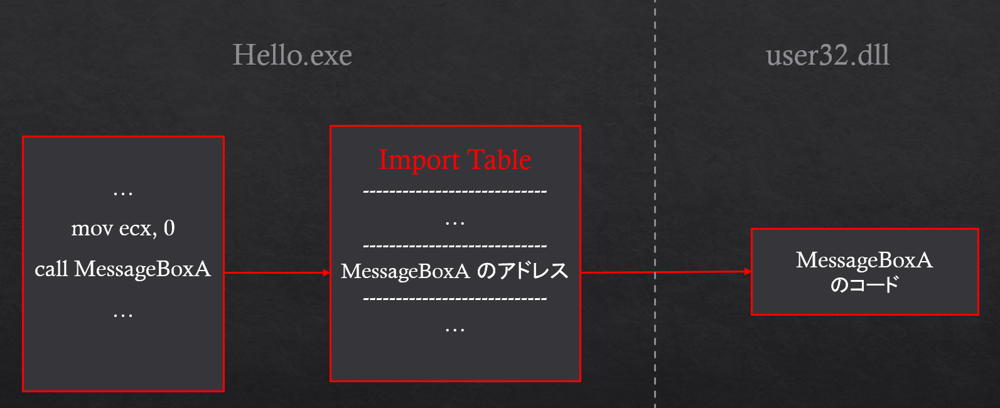
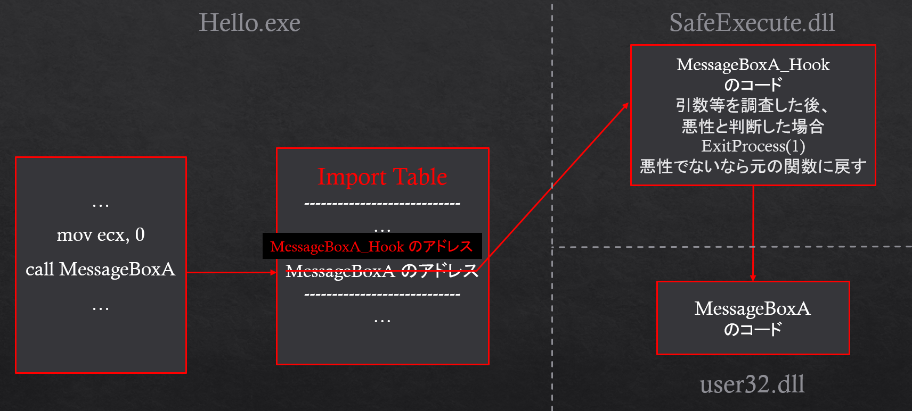

# 安全実行侍 ~俺を信じろ~

## 概要

安全実行侍 ~俺を信じろ~（以下、安全実行侍）は、実行ファイルの禁止したい挙動を選択することで、不安な実行ファイルを安全に実行することができるツールです。<br>

* 基本的な流れ
	1. ユーザが実行ファイルの禁止したい挙動をチェックボックスで選択する
	2. 安全実行侍で実行ファイルを実行する
	3. チェックを入れた挙動が検知された場合、設定したモードに応じて
		1. 実行の停止
		1. 停止要因となった挙動を表示後、実行の停止
		1. 停止要因となった挙動を表示し、実行を継続するか停止するかを決定する
		
		を行う

* 対象となる実行ファイル
	* 64bitのPEファイル (.exe)

例えば、ネットワーク接続しないはずの実行ファイルを実行するときに、ネットワーク接続の挙動を禁止しておけば、もし実体が悪意のある実行ファイルでネットワーク接続を試みたとしても安全に停止することができます。

* その他の使用シチュエーション例
	* 実行が不安なファイルを実行したいが、アンチウィルスソフトだけでは心許ない
	* アンチウィルスソフトが実行を阻害した実行ファイルだが、何が原因なのかを調べたい
	* 実行ファイルの挙動を簡易的に知りたい

検知対象となる挙動の検知は、各WindowsAPIの実行の検知として実装されています。

## 特徴

安全実行侍の特徴は主に以下の2点です。

1. **実行ファイルの禁止したい挙動をユーザが選択できる**
2. **実行ファイルの実行を可視化できる**

1.については、後述のように、ユーザが禁止したいWindowsAPIの使用を1関数ずつ指定できるので非常に細かく挙動を制限することができます。これにより、安全に実行する以外にも、安全だと分かっている挙動は制限から外したい、実行ファイルの挙動を知りたい、などのニーズに応えることができます。

2.については、簡単な設定を行う事で、実行ファイルのどの挙動が検知されて停止したのか(停止するかを確認されているのか)を表示させることができます。これにより、実行ファイルの挙動の把握や、検知対象とする挙動の再検討を行うことができます。

## インストール方法

// TODO　//

## 使用方法

安全実行侍は、使用方法としてGUI、CUIの両方に対応しています。

※ アンチウィルスソフトに安全実行侍の実行を止められる場合があります。

### GUIで使う場合

1. 「安全実行侍～俺を信じろ～.exe」を実行すると、安全実行侍のウィンドウが起動します。
1. ウィンドウの左側にある（下図(a)）「実行に制限をかける項目」で制限したい項目にチェックを入れてください。
1. ウィンドウの左側にある（下図(b)）「モード選択」を選んでください。<br>
	各モードは「実行に制限をかける項目」でチェックをいれた挙動を検知したときの挙動が異なります。
	* 「通常モード」：検知後、実行を停止します。
	* 「エラー表示モード」：検知後、検知した内容を表示し、実行を停止します。
	* 「インタラクティブモード」：検知後、検知した内容を表示し、実行を継続するかの確認を行います。ユーザは実行を継続するか、停止するかを選択することができます。
1. ウィンドウの上側にある（下図(c)）「実行ファイル」に、安全に実行させたい実行ファイルを指定してください。その下の「引数」は実行ファイルの実行の際に必要な引数があれば入力してください。
1. 以上の準備が終わったら、ウィンドウの右上（下図(c)）の「実行」ボタンを左クリックしてください。安全に実行ファイルが実行されます。



#### 実行の様子
// TODO：gifを挿入する //

### CUIで使う場合

#### リリースから実行する場合

1. rulesディレクトリのrules.csvがGUIでの「実行に制限をかける項目」に対応しており、「WindowsAPI名, 1」とした行のWindowsAPIを検知します。制限したい項目は1、制限したくない項目は0に設定してください。（※初期設定では、全て1に設定されています。）<br>
また、rulesディレクトリのmode.txtは、0~2の半角数字を1つ設定してください。「0:通常モード」「1:エラー表示モード」「2:インタラクティブモード」と対応しています。
1. 本README.mdが置いてあるディレクトリにおいて、以下のコマンドを実行してください。安全に実行ファイルが実行されます。<br>
```bash
<SafeExecutor.exeのパス> <SafeExecute.dllのパス> <実行ファイルのパス>
```

#### ソースコードから実行する場合

1. SafeExecuteディレクトリ直下のSafeExecuteディレクトリ、SafeExecutorディレクトリの各ディレクトリの直下にある.slnファイルを、VisualStudioでx64でビルドしてください。<br>
	※ もし、ビルド時にエラーが発生した場合は、「LF」を「CRLF」に変更し、「プロジェクト→プロパティ→構成プロパティ→詳細→文字セット」を「マルチバイト文字セットを使用する」に変更し、「ビルド」から「ソリューションのクリーン」と「ソリューションのビルド」を順に行ってください。

1. rulesディレクトリのrules.csvがGUIでの「実行に制限をかける項目」に対応しており、「WindowsAPI名, 1」とした行のWindowsAPIを検知します。制限したい項目は1、制限したくない項目は0に設定してください。（※初期設定では、全て1に設定されています。）<br>
また、rulesディレクトリのmode.txtは、0~2の半角数字を1つ設定してください。「0:通常モード」「1:エラー表示モード」「2:インタラクティブモード」と対応しています。
1. 本README.mdが置いてあるディレクトリにおいて、以下のコマンドを実行してください。安全に実行ファイルが実行されます。<br>
```bash
<SafeExecutor.exeのパス> <SafeExecute.dllのパス> <実行ファイルのパス>
```


## 主な構成要素

* SafeExecute：検知を実施する実行ファイルのWindowsAPIをフックし、挙動の監視、指定した挙動の検知及びその対応を行う
* SafeExecutor：検知を実施する実行ファイルにSafeExecuteを組み込んで実行する
* SafeExecutorGUI：GUIの実装
* TestExecutables：テスト用のソースプログラム、実行ファイルなどが含まれる
* backups：安全実行侍は、実行ファイルが読み書きするファイルを全てバックアップする機能があり、backupsディレクトリにバックアップしたファイルを格納する
* logs：安全実行侍は、いつどのような実行ファイルで何のWindowsAPIをフックしたかをログとして残す機能があり、logsディレクトリ内にlog.csvとして保存される
* rules：安全実行侍の「実行に制限をかける項目」と「モード選択」の設定を保持するファイルを含む

## 仕組み

安全実行侍は、検知を実施する実行ファイルのWindowsAPIを監視することで、その実行ファイルの挙動が怪しいかどうかを判断します。
ユーザは、どのWindowsAPIの使用を制限（検知）するか選択することができ、選択した項目について、該当すれば検知が行われます。

この監視及び検知は、APIフックという手法を用いて実装されています。

以下では、以下のHello.exeを実行する例を用いて監視及び検知の方法を説明します。

```cpp
#include <windows.h>
#include <cstdio>

int WINAPI WinMain(HINSTANCE hInstance, HINSTANCE hPrevInstance, LPSTR lpCmdLine, int nCmdShow) {
	MessageBoxA(NULL, "Hello World!", "Info", MB_YESNO);
	return 0;
}

```

上記のプログラムは、メッセージボックス用いて文字列などを表示するだけのプログラムです。
本来は、上記で用いているMessageBoxAは、以下のようにuser32.dllから呼び出されます。



安全実行侍において、「メッセージボックスを表示する挙動」が検知対象に含まれていた場合を考えます。

このとき、Hello.exeを安全実行侍を用いて実行すると、安全実行侍はMessageBoxというWindowsAPIにAPIフックを掛けます。

以下の図はAPIフックがかかった際の動作を表しています。



上図で示すように、関数呼び出しの間に、フック関数が入ります。フック関数で、呼び出されたWindowsAPIの引数などを調査し、それらに応じて悪性かを判断し、悪性であれば、モードに応じてエラー表示や実行継続確認を行った後、実行終了と判断されれば、実行終了(ExitProcess)し、悪性であるが実行継続と判断される、もしくは悪性でない場合は、元のWindowsAPI (上図ではMessageBoxA)の処理に戻されます。

以上が、仕組みの説明になります。