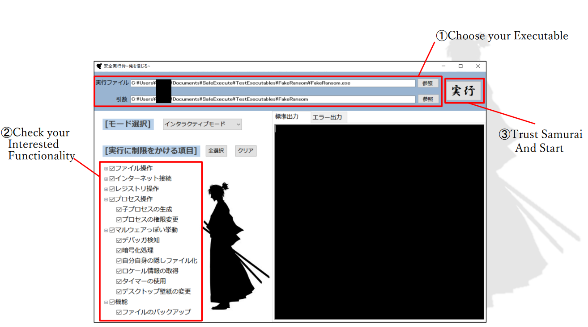
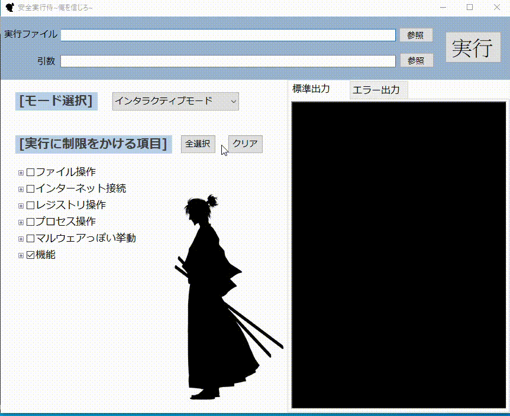

# SafeExecute Samurai (English Introduction)

## Summary
### SafeExecute Samurai is an software checker that Restrict and Visualize application execution.
SafeExecute Samurai provides safe execution to some unknown executable files and notify users with major Windows API calls used in some malware during their runtime. 
User is able to either continue it or interrupt it when any hook occurs. It's also possible to learn what API has been used on any applications you want to test with SafeExecute Samurai!

> **Note**   **English GUI Interface is not yet implemented!**


<br/>


## Installation
1. Unzip our [latest released](https://github.com/MachineHunter/SafeExecute/releases) ".zip" file.
2. Start "SafeExecutorGUI.exe"


<br/>


## Usage

### GUI Usage



1. Open "SafeExecutorGUI.exe"
2. Select your target executable file. If any argument is needed, you can input them in the second line. In the (1) part of above image.
4. Choose Mode. There are Normal mode with stdout, Error mode with stderr, and Interactive mode with messagebox showing, Interactive mode is suggested.
5. Click on the Windows API type you interested in.
6. Click "Run" and start!

<details>
   <summary>What is argument?</summary>
   
For example:
```sh
echo.exe "arg1"
```
After selecting echo.exe, you need to put the argument in the arguments section.
</details>

### Command Line Usage
```sh
./SafeExecutor.exe SafeExecute.dll <path-to-executables> <arguments>
```

<br/>


## Features
* Runtime Analysis
* Portable
* Self-Determination
* Understand Program Content
* User-Friendly Suggestion System

Compared to Anti-Malware or Anti-Virus system which often scan and detect executables in your computer, SafeExecute Samurai is a portable tool that does dynamic detection without using any dataset and Internet to support its functioning. For instance, Anti-Malware software may able to erase files when detect something malicious, however, the software does not tell the reason being suspicious, so if user wants to learn more about some malicious files, SafeExecute Samurai is the best choice that protect user by assisting user during the execution and provide an option to interrupt the target executables when found suspicious Windows API being called, also they can decide whether to continue or not by themselves, without any third-party's suggestions or judgements.
It's also a good tool for experienced researchers and programmers to investigate Windows executables!


<br/>


## Important Files
* SafeExecute Samurai's Directory
    * **SafeExecute.dll**: Contains our hook methods, Windows API will be detected by our code and will not execute without the user's confirmation.
    * **SafeExecutor.exe**: A program combining hook methods and target executables with arguments, we can consider it as an input machine. Users can just use "SafeExecutorGUI.exe" when using!
    * **SafeExecutorGUI.exe**: GUI interface for SafeExecute Samurai.

* User Setting Directory (`C:\Users\<username>\AppData\Local\安全実行侍～俺を信じろ～`)
    * **logs/logs.csv**: Recorded execution results of every use.
    * **rules/mode.txt**: For command line users, `0` for normal mode, `1` for debug mode, `2` for interactive mode which is suggested. 
    * **rules/rules.csv**: For command line users, it shows every Windows API that can be hooked by SafeExecute Samurai. `1` for turn-on mode, `0` for turn-off mode.


<br/>

## About Github Repository

* [Issues](https://github.com/MachineHunter/SafeExecute/issues): Our contributors' work are in this section, including completed work and works in progress.
* [Discussions](https://github.com/MachineHunter/SafeExecute/discussions): Our meetings for developing SafeExecute Samurai application.
* [Wiki](https://github.com/MachineHunter/SafeExecute/wiki) : We prepared wiki pages for various presentations.
	* [安全実行侍の仕組み (SafeExecute Samurai's structure)](https://github.com/MachineHunter/SafeExecute/wiki/%E5%AE%89%E5%85%A8%E5%AE%9F%E8%A1%8C%E4%BE%8D%EF%BD%9E%E4%BF%BA%E3%82%92%E4%BF%A1%E3%81%98%E3%82%8D%EF%BD%9E(SafeExecute)%E3%81%AE%E4%BB%95%E7%B5%84%E3%81%BF)
	* [検知するWindowsAPIを追加実装する方法 (How to expand our contribution and add new Windows API hook in SafeExecute Samurai)](https://github.com/MachineHunter/SafeExecute/wiki/%E6%A4%9C%E7%9F%A5%E3%81%99%E3%82%8BWindowsAPI%E3%82%92%E8%BF%BD%E5%8A%A0%E5%AE%9F%E8%A3%85%E3%81%99%E3%82%8B%E6%96%B9%E6%B3%95)
	* [安全実行侍のGUIの追加実装方法 (How to expand SafeExecute Samurai's GUI interface)](https://github.com/MachineHunter/SafeExecute/wiki/SafeExecutorGUI(%E5%AE%89%E5%85%A8%E5%AE%9F%E8%A1%8C%E4%BE%8D%EF%BD%9E%E4%BF%BA%E3%82%92%E4%BF%A1%E3%81%98%E3%82%8D%EF%BD%9E)%E3%81%AE%E8%BF%BD%E5%8A%A0%E5%AE%9F%E8%A3%85%E6%96%B9%E6%B3%95)
	* [安全実行侍の、通常アプリを用いた評価結果 (Evaluate Regular Applications with SafeExecute Samurai)](https://github.com/MachineHunter/SafeExecute/wiki/%E9%80%9A%E5%B8%B8%E3%82%A2%E3%83%97%E3%83%AA%E3%81%AE%E8%A9%95%E4%BE%A1)
	* [マルウェア調査 (Malware Research)](https://github.com/MachineHunter/SafeExecute/wiki/%E3%83%9E%E3%83%AB%E3%82%A6%E3%82%A7%E3%82%A2%E8%AA%BF%E6%9F%BB)
* [branch](https://github.com/MachineHunter/SafeExecute)
	* [release-1.0](https://github.com/MachineHunter/SafeExecute/tree/release-1.0): Release v1.0
	* [release-test](https://github.com/MachineHunter/SafeExecute/tree/release-test): Test Release

<br/>

## Showcase

### Example1 (Internet Connection Detection)

Here is an example of executing a program that wants to open a url of Github.
Normaly, we are not able to see where executables are trying to connect.
But by using SafeExecute Samurai, as we can see, where executables are trying to connect is visible.




And here is the part when we reject its execution, the process stopped before Windows API call.


<br/>


### Example2 (Pseudo Ransomware Detection)

Here is an example of executing a fake ransomware we made that tries to encrypt all the ".txt" files in the path given to argument.
Normally, when we execute a malicious ransomware-like software, everything has changed when user run this program, for example files being encrypted. But if user execute this program with our SafeExecute Samurai, he/she can easily see information like Encryption function called and decide to stop it before any destruction. 

As we can see, there are many pop up messages showing Windows API methods such as Encrypting, File Iteration, and Write Files, there are also further information around these function calls. In detail, we implement this fake ransomware program to traverse target directory and find ".txt" files to encrypt, what leads to the amount of pop up messages because it uses APIs to do file iteration, encryption, and file writing.


And here is the part when we reject its execution, nothing happened to our files and saved the day!


<br/>


## Behind the Scenes
SafeExecute Samurai uses an API hook to monitor target executable. Users are able to decide whether to continue or not when SafeExecute Samurai hooks any Windows API user select.
About how we produced this technique, here is an example code we programmed similar to our released code. Let's see through this example executable "hello.exe":

```c++
#include <windows.h>
#include <cstdio>

int WINAPI WinMain(HINSTANCE hInstance, HINSTANCE hPrevInstance, LPSTR lpCmdLine, int nCmdShow) {
    MessageBoxA(NULL, "Hello World!", "Info", MB_YESNO);
    return 0;
}
```

This program is really simple. It'll show a message box by calling Windows API "MessageBoxA", and this API is from library "user32.dll", so the process during runtime will look like the image below.


About what we try to do in SafeExecute Samurai is that instead of getting the real "MessageBoxA", we covered the address of "MessageBoxA_Hook" ,which is our contribution in SafeExecute.dll, over the address of "MessageBoxA". The process during runtime will become like the image below.


You may somehow wonder what is inside "MessageBoxA_Hook", before calling the real "MessageBoxA" we added a message box that contains "yes" and "no" with some knowledge about the function calls being hooked, in that case users can figure out whether to continue or not by themselves, without any third-party's suggestions or judgements. If the user chooses not to continue, SafeExecute Samurai will easily call "ExitProcess" at that moment and end the process.

In many cases, SafeExecute Samurai will hook out many Windows APIs because of the wide variety of functionalities in a program or executable. You can still continue running by clicking "yes" every time a hook pops up, to make it personalize we also added a checklist which users can choose what kind of Windows API should be hooked, and the others will not.

I hope you enjoy using SafeExecute Samurai. Good Luck!


