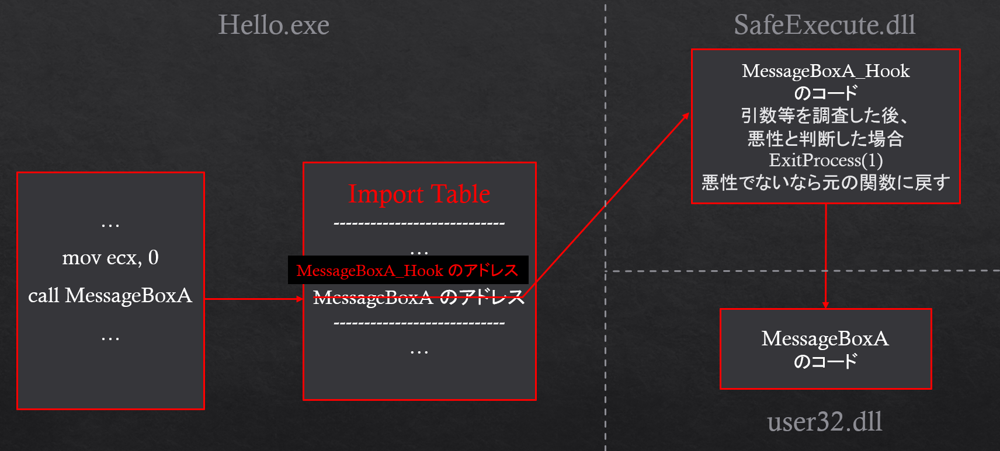

# SafeExecute (English Version)

## Summary
### SafeExecute is an executable checker that will detect any Windows API calls during runtime.
In detail, we implement our API hooking code into a dll file called "SafeExecute.dll". When users provide their executables, SafeExecute will run it with a dll file which changes the behavior of the target executable into multiple confirmation messages when any chosen Windows API is called.

## Usage
### SafeExecute provides safe execution to some unknown executable files and notify users with all of the Windows API calls during their runtime. 
User is able to either continue it or interrupt it when any hook occurs. It's also possible to learn what API has been used on any applications you want to test with SafeExecute!

## Features
* Runtime Analysis
* Portable
* Self-Determination
* Understand Program Content
* User-Friendly Suggestion System

Compared to Anti-Malware or Anti-Virus system which often scan and detect executables in your computer, SafeExecute is a portable tool that does dynamic detection without using any dataset and Internet to support its functioning. For instance, Anti-Malware software may able to erase files when detect something malicious, however, the software does not tell the reason being suspicious, so if user wants to learn more about some malicious files, SafeExecute is the best choice that protect user by assisting user during the execution and provide an option to interrupt the target executables when found suspicious Windows API being called, also they can decide whether to continue or not by themselves, without any third-party's suggestions or judgements.
It's also a good tool for experienced researchers and programmers to investigate Windows executables!

## Installation(For people who don't have Visual Studio developing environment)
* If you already have Visual Studio in your computer, just open "SafeExecutorGUI.exe".
* If you don't have Visual Studio in your computer, please follow the steps below to open it with MSIX package. We need users to add Reliable Creator to your computer manually.
  1. Right click ".crt" file and choose **Install Certificate**.
  2. You can choose to install it on local computer.
  3. After installing, you can check if this certificate is in the list by opening "certmgr. msc" from Windows Search Engine beside your Windows icon. (Default is at left bottom of your screen)
  4. Double click ".appxbunldle" file and start install SafeExecute.

## How to...
1. Open "SafeExecutorGUI.exe"
2. Select your target executable file.
3. If any argument is needed, you can input them in the second line.
4. Choose Mode. There are Normal mode with stdout, Error mode with stderr, and Interactive mode with messagebox showing, Interactive mode is suggested.
5. Click on the Windows API type you interested in.
6. Click "Run" and start!

For example:
```sh
echo.exe "arg1"
```
After selecting echo.exe, you need to put the argument in the arguments section.

## Important Files
* **SafeExecute.dll**: Contains our hook methods, Windows API will be detected by our code and will not execute without the user's confirmation.
* **SafeExecutor.exe**: A program combining hook methods and target executables with arguments, we can consider it as an input machine. Users can just use "SafeExecutorGUI.exe" when using!
* **SafeExecutorGUI.exe**: GUI interface for SafeExecute.

## Command Line Usage
```sh
./SafeExecutor.exe SafeExecute.dll <path-to-executables>
```

## Showcase
Here is an example of executing a program that wants to open a url of Github. And we tried to allow all the APIs by clicking "yes".


And here is the part when we reject its execution.


Here is an example of executing a fake ransomware we made that tries to encrypt all the ".txt" files in the path of input argument. And we all the APIs by clicking "yes".


And here is the part when we reject its execution.


## Behind the Scenes
SafeExecute uses an API hook to monitor target executable. Users are able to decide whether to continue or not when SafeExecute hooks any Windows API user select.
About how we produced this technique, here is an example code we programmed similar to our released code. Let's see through this example executable "hello.exe":

```c++
#include <windows.h>
#include <cstdio>

int WINAPI WinMain(HINSTANCE hInstance, HINSTANCE hPrevInstance, LPSTR lpCmdLine, int nCmdShow) {
    MessageBoxA(NULL, "Hello World!", "Info", MB_YESNO);
    return 0;
}
```

This program is really simple. It'll show a message box by calling Windows API "MessageBoxA", and this API is from library "user32.dll", so the process during runtime will look like the image below.


About what we try to do in SafeExecute is that instead of getting the real "MessageBoxA", we covered the address of "MessageBoxA_Hook" ,which is our contribution in SafeExecute.dll, over the address of "MessageBoxA". The process during runtime will become like the image below.



You may somehow wonder what is inside "MessageBoxA_Hook", before calling the real "MessageBoxA" we added a message box that contains "yes" and "no" with some knowledge about the function calls being hooked, in that case users can figure out whether to continue or not by themselves, without any third-party's suggestions or judgements. If the user chooses not to continue, SafeExecute will easily call "ExitProcess" at that moment and end the process.

In many cases, SafeExecute will hook out many Windows APIs because of the wide variety of functionalities in a program or executable. You can still continue running by clicking "yes" every time a hook pops up, to make it personalize we also added a checklist which users can choose what kind of Windows API should be hooked, and the others will not.

I hope you enjoy using SafeExecute. Good Luck!


